# PC-98 Look in Ren'Py (16-colour palette + ordered dithering + palette-register light effects)

**One shader on the master layer. Ordinary 1920x1080 art goes in, a 640x360 / 16-colour PC-98 screen comes out.**

A proof of concept for giving a [Ren'Py](https://www.renpy.org/) visual novel the look of a
late-80s / early-90s NEC PC-9801 game: coarse pixel grid, one 16-colour palette per scene
(every colour a legal 4-bit-per-channel PC-98 colour), Bayer ordered dithering, and light
effects done the way the real machine did them, by manipulating palette registers. Everything
happens in a single GLSL fragment shader; backgrounds and sprites are untouched PNG/WebP files.

📺 **Video:** [Emulating PC-98 Limited Color Palette Lighting Effects on Modern Ren'Py Sprites](https://youtu.be/vSPSRfWY7Os)
(7 min, Gemini TTS voice-over): pixelate → 16 colours → Bayer dither, per-scene palettes,
pre-quantisation lights and palette-register tricks (fade, night swap, lightning, police-siren
colour cycling). The pipeline is in production in the author's game *Shafted in the Snow*.

[](https://youtu.be/vSPSRfWY7Os)

| Original | 4096 colours (4 bit/channel) + 2x2 dither | 16-colour scene palette |
|---|---|---|
|  | 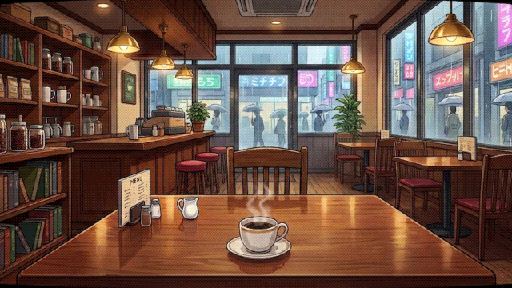 | 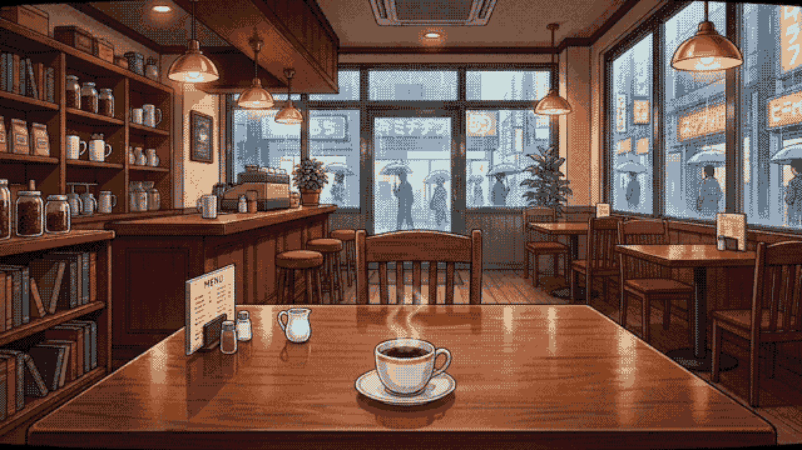 |

| No dither | 2x2 Bayer | 4x4 Bayer | 8x8 Bayer |
|---|---|---|---|
| 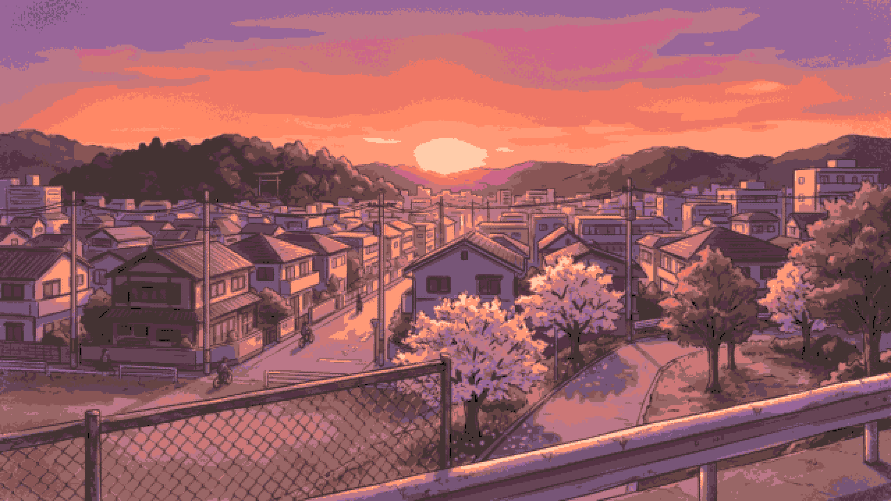 | 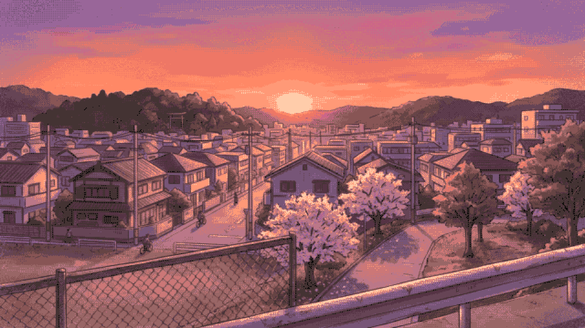 |  |  |

| Generic palette (has skin tones) | Per-scene palette (no skin tones) |
|---|---|
| 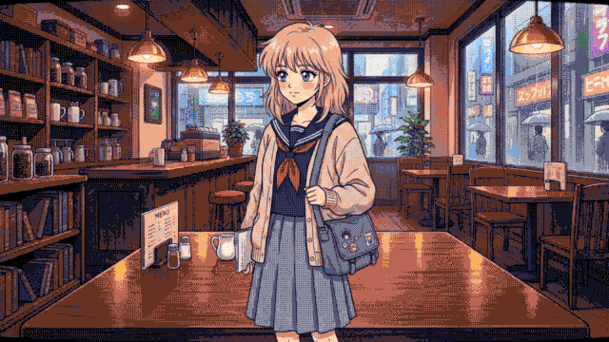 | 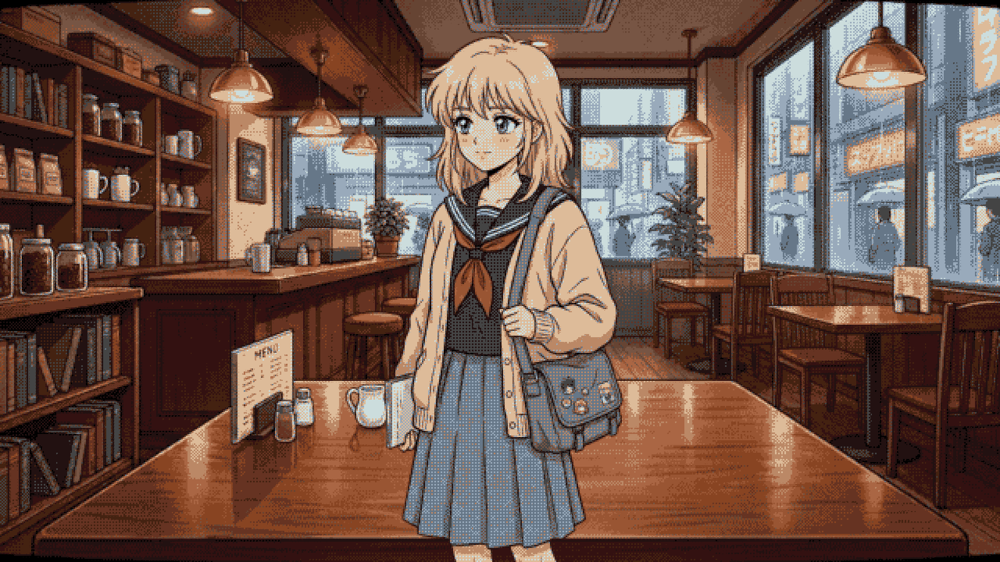 |

| Candles, lights off | Candles, two flickering point lights | Night ambient + flashlight |
|---|---|---|
| 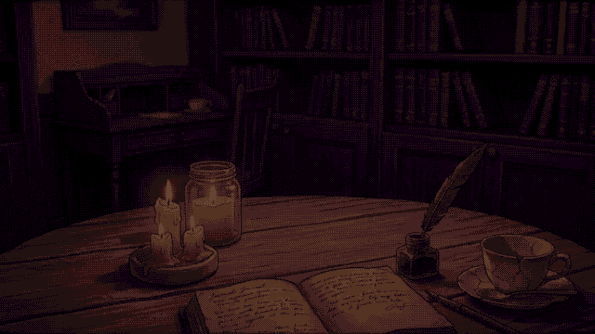 | 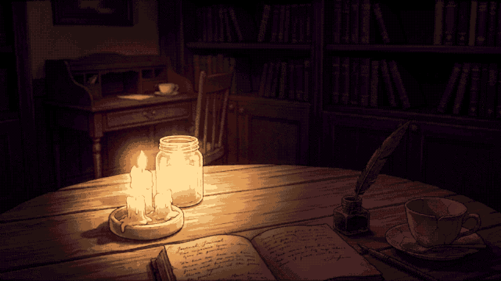 | 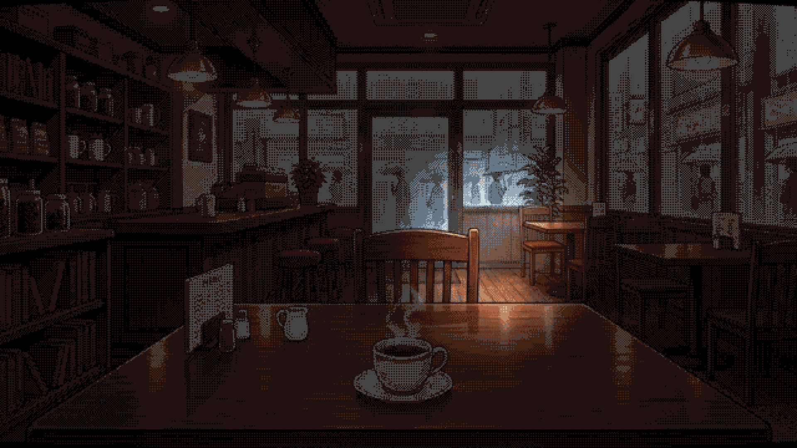 |

| Hardware fade-in (mid-way) | Night palette (register swap) | Lightning (register slam) |
|---|---|---|
| 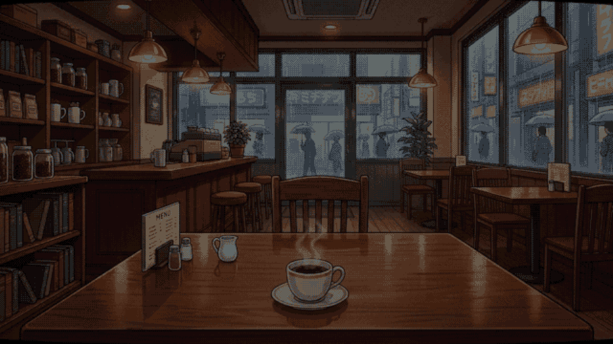 | 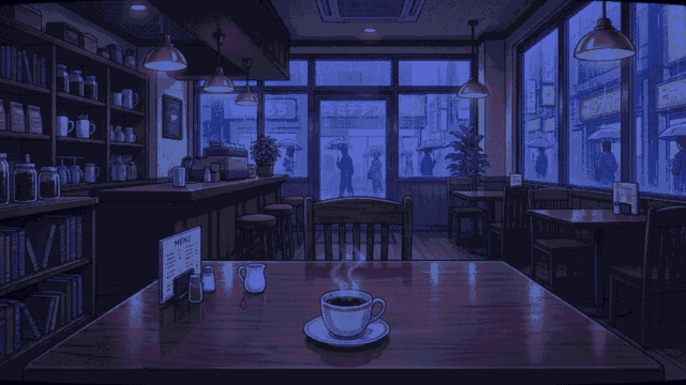 | 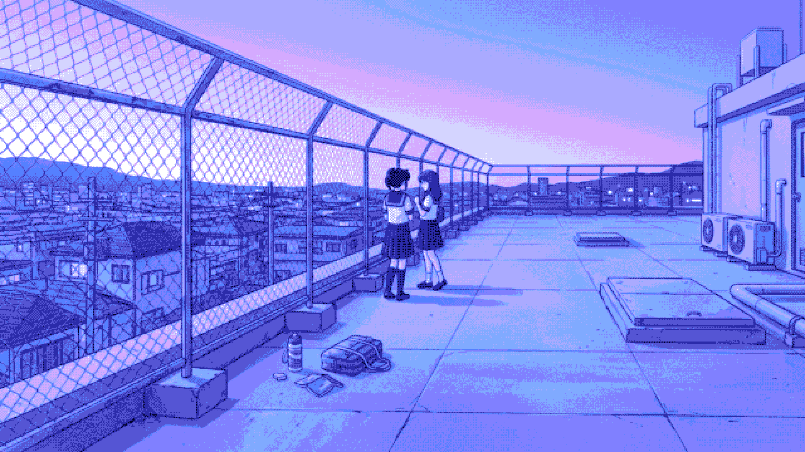 |

| CRT scanlines | 8-colour digital palette (PC-88) |
|---|---|
| 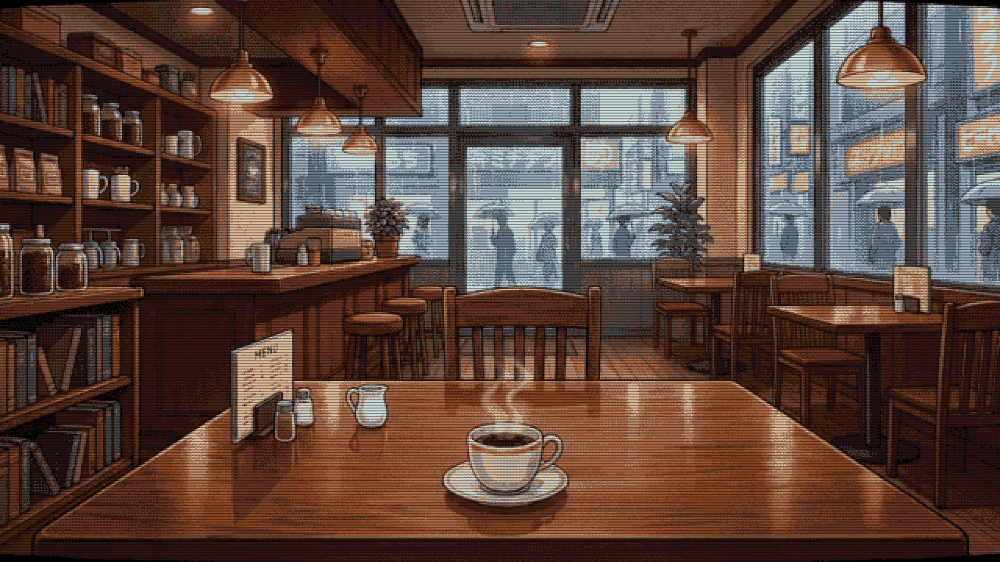 | 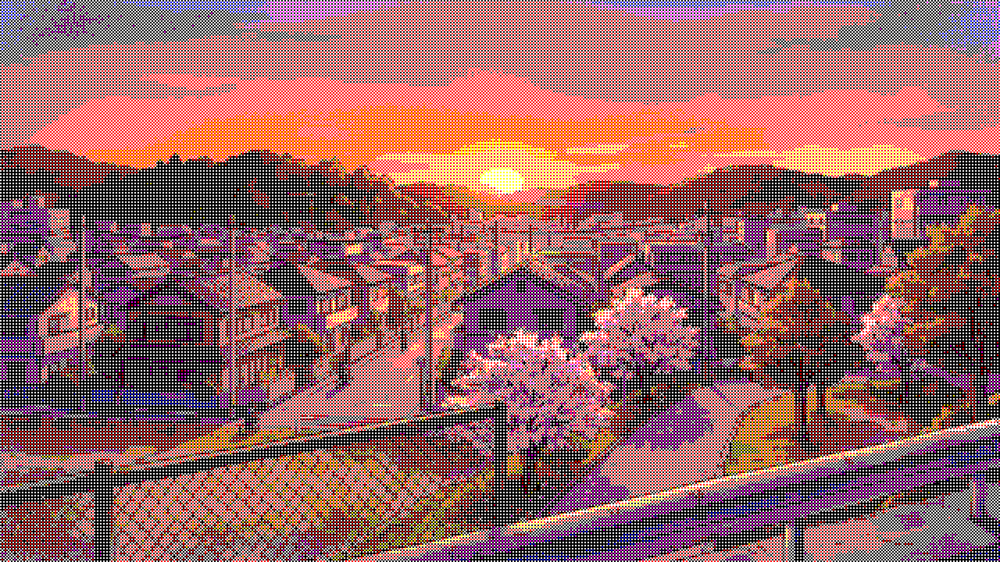 |

## How it works

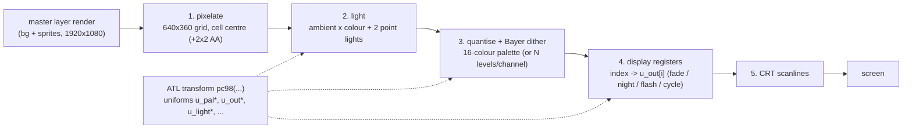

### 1. The whole layer goes through one transform

```renpy
show layer master at pc98(palette="cafe")          # on
$ renpy.layer_at_list([], "master")                # off
```

`pc98()` is an ATL transform with `mesh True` and `shader "pc98.retro"`; every argument becomes
a shader uniform. The say window lives on the `screens` layer, so text stays crisp (the same
trick "Shafted in the Snow" uses with `config.layer_transforms`).

### 2. Lighting happens *before* quantisation

```glsl
vec3 light = u_ambient
           + u_light1_color * pc98_point_light(cuv, u_light1_pos, aspect)
           + u_light2_color * pc98_point_light(cuv, u_light2_pos, aspect);
rgb = clamp(rgb * light, 0.0, 1.0);
```

Because the palette step comes after, a smooth candle halo turns into concentric dither rings,
exactly how hand-dithered PC-98 candlelight looked. Point light positions and colours are plain
uniforms, so ATL `linear` blocks animate the flicker with no per-frame Python.

### 3. 16-colour palette with a two-candidate ordered dither

The Bayer threshold is computed arithmetically per emulated pixel (2x2 / 4x4 / 8x8, no matrix
constants). For an arbitrary palette the shader finds the nearest colour `c1`, then the nearest
colour to the point reflected across it (`c2`, "the other side of the error"), projects the target
onto the `c1 -> c2` segment to get the mix ratio, and picks `c2` when the ratio beats the
threshold:

```glsl
int  i1 = pc98_nearest(c);
vec3 c1 = pc98_pal_at(i1);
int  i2 = pc98_nearest(c + (c - c1));
vec3 d  = pc98_pal_at(i2) - c1;
float f = clamp(dot(c - c1, d) / dot(d, d), 0.0, 1.0);
return (t < f) ? pc98_out_at(i2) : pc98_out_at(i1);
```

Mode 0 skips the palette and quantises each channel to `u_levels` steps instead
(15 = 4 bits = the 4096-colour PC-98 hardware space, 1 = the 8-colour PC-88 digital palette).

### 4. Match palette vs display palette = hardware palette tricks

The shader matches against `u_pal0..15` but *outputs* `u_out0..15`. Normally they are the
same palette. Changing only the display registers gives the classic PC-98 effects with every
pixel keeping its colour index (no re-quantisation, no dither crawl):

| Effect | How |
|---|---|
| Fade in / out | `PC98PaletteFade("black", "cafe", 2.0)` ramps `u_out*` |
| Day -> night | `PC98PaletteFade("cafe", "cafe_night", 2.5)` (night palette derived register by register) |
| Lightning | `u_post_tint (6.0, 6.0, 6.0)` for two frames, then `linear` back |
| Police siren | `PC98ColorCycle("street", 0.25, indices=pc98_siren("street"))` swaps the red and blue registers |

### 5. One palette per scene, like the real thing

`tools/make_palettes.py` (Pillow + NumPy) picks the 16 colours per background so that **as little
as possible has to be dithered**: a pixel-count-weighted k-means over the scene's 4-bit colour
histogram (the objective is the quantisation error weighted by how many pixels use each colour),
with black forced at index 0 and every centre snapped to 4 bits per channel so it is a legal PC-98
colour. For background+sprite composites the sprite's pixels weigh 4x, so the character gets exact
colours first and is drawn flat. It writes `game/palettes_generated.rpy`, a `*_night` variant of
each palette (register-by-register cold shift) and a swatch strip per palette, and prints per
palette the RMS error and the share of pixels within one 4-bit step of a palette entry.

The shader completes the job with a **dead zone** (`flat=0.12`): when the pixel would get fewer
than that fraction of the second candidate colour, it is drawn flat. That removes speckle on
near-flat areas while soft gradients keep dithering. The dead zone is relative to the distance
between the two candidates on purpose: an absolute one (in colour steps) turned smooth skies into
plateaus with hard steps, because with palette entries two steps apart nothing in between was
dithered. Smooth regions of the image (little edge energy) also weigh 4x in the palette k-means,
so gradients get enough evenly spaced entries. `poc_shots/poc_pal16_cafe_nodeadzone.png` shows the
same scene with `flat=0.0` for comparison. Hand-made palettes go in `pc98_palettes` in
`game/shaders_pc98.rpy` (`classic` is a generic 16-colour set with skin tones).

## Files

| File | What it is |
|---|---|
| `game/shaders_pc98.rpy` | Shader registration, the `pc98()` transform, presets, ATL helper classes |
| `game/palettes_generated.rpy` | Generated per-scene palettes (do not edit) |
| `game/script.rpy` | Interactive demo: menu hub with 10 scenarios |
| `game/autotest.rpy` | Headless self-check: renders every preset to `poc_shots/` |
| `game/videodemo.rpy` | Scripted, non-interactive run for the video (`RENPY_POC_VIDEO=1`) |
| `tools/make_palettes.py` | Palette extraction tool: dither-minimising weighted k-means (backgrounds, background+sprite composites, swatch strips) |
| `make_voiceover.py` | Gemini TTS narration -> `vo/*.wav` + `vo/durations.json` |
| `record_video.sh` | Records the demo to `poc_video.mp4` via Xvfb + ffmpeg + xdotool |
| `mix_voiceover.py` | Places the clips at the recorded cues -> `poc_video_vo.mp4` |

## Running it

Drop a Ren'Py SDK (8.x) into `renpy-sdk/` (a symlink works), then:

```bash
./renpy-sdk/renpy.sh .                       # interactive demo
RENPY_POC_AUTOTEST=1 ./renpy-sdk/renpy.sh .  # render all presets to poc_shots/
python3 tools/make_palettes.py               # regenerate palettes after changing backgrounds
```

Video (needs Xvfb, ffmpeg, xdotool and a `GEMINI_API_KEY` in the environment or in `.env`):

```bash
python3 make_voiceover.py    # TTS clips; scene lengths adapt to them
./record_video.sh            # poc_video.mp4 + poc_video_cues.json
python3 mix_voiceover.py     # poc_video_vo.mp4
```

Headless (no desktop session):

```bash
Xvfb :99 -screen 0 2560x1440x24 & 
env -u WAYLAND_DISPLAY DISPLAY=:99 SDL_VIDEODRIVER=x11 SDL_AUDIODRIVER=dummy \
    RENPY_POC_AUTOTEST=1 ./renpy-sdk/renpy.sh . --savedir "$(mktemp -d)"
```

## Notes and gotchas

- **Ren'Py only declares the uniforms referenced in a `fragment_NNN` body.** Uniforms used only
  inside `fragment_functions` come out as "undeclared", so the palette registers are copied into
  the working arrays in the stage body, not in a helper.
- **Portable GLSL.** No `const` arrays, no array constructors, no dynamic array indexing in the
  fragment shader (ES 1.00 rules); array lookups walk a constant-index loop. The shader compiles
  as GLSL 1.20 (desktop `gl2`) and should on ANGLE/GLES.
- **Uniform count.** 32 `vec3` palette registers plus a dozen others is ~130 floats, fine on
  desktop and ES 3.0 (ANGLE) but above the GLSL ES 1.00 *minimum* of 16 `vec4`.
- **Premultiplied alpha.** The layer texture is premultiplied; the shader un-premultiplies before
  quantising and re-multiplies on output, so the effect also works on a single sprite.
- **Saving mid-effect.** The ATL `function` helpers are picklable classes (not closures) so
  saving during a fade or a cycle works.
- Tested with Ren'Py 8.6.0 on Linux (gl2, llvmpipe under Xvfb).

## Credits & disclaimer

- Code: MIT (see `LICENSE`).
- The backgrounds and the "Claire" sprite are assets from the in-progress game
  *Shafted in the Snow* and are included solely as a technical demonstration; they are **not**
  covered by the MIT license.
